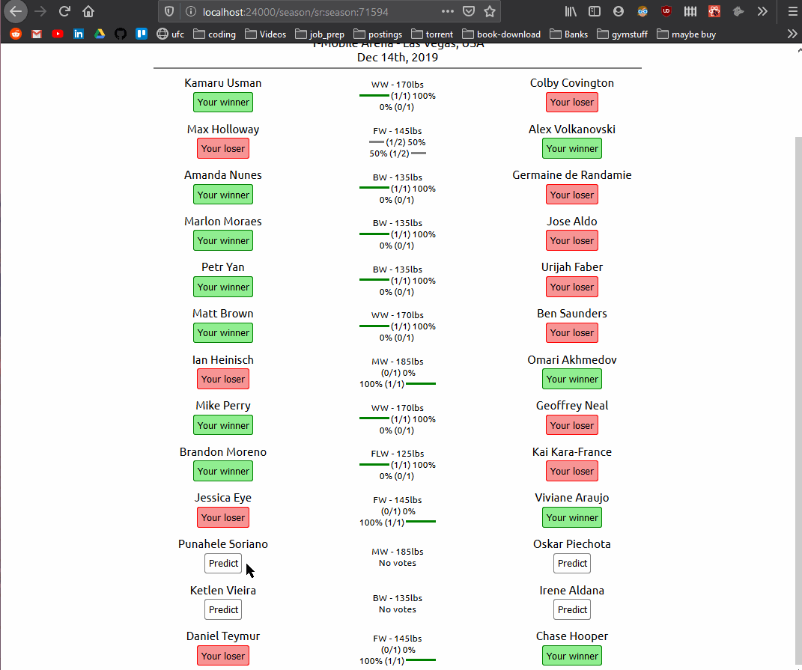

## UFC Guesser

#### About
I made this website to collect UFC data from SportsRadar, present it on the website to view upcoming and past fights, and most importantly predict who I think will win. You have to create an account to predict on fights and view your "potential" earnings for a fight card or totals.

You can also see what the community has voted for, and as admin I can reorder the fights if necessary since that information is oddly missing from the API.

#### Challenges
This is mainly why I wanted to do web development. I wanted a simple program where I made scheduled API calls to store into a personal database so that I could then work with it later. I struggled to do that 6 months ago but I made this to finally achieve it. I set up cron jobs so the API requests dont mess with the API limits, fairly complex functions to deal with missing data and updating data so I could avoid as much repetition as possible.

This is the first time I am really working with data that I am not creating so I had to deal with a lot of missing values and weird issues that arose from working with an external API.

#### Lessons Learned
* Setting up cron jobs and dealing with missing data from API requests
* caching API requests so I don't theoretically overload my backend with the same season data request
* using cookies to store web tokens and then also obtaining those cookies from the request in the backend
* dealing with null values from external data and inserting into Postgres

#### Languages/Frameworks
* PostgreSQL
* NodeJS
* Express
* Styled Components, Axios, Hooks
* React
* CRON jobs to gather/update data on a schedule will have to tweak fights that are more recent so on and so forth, but every sunday morning should be fine.
* Async/Await, implementing PropTypes, useContext, cookies for JWT

#### Sample View of predicting on a fight and rearranging fight order

